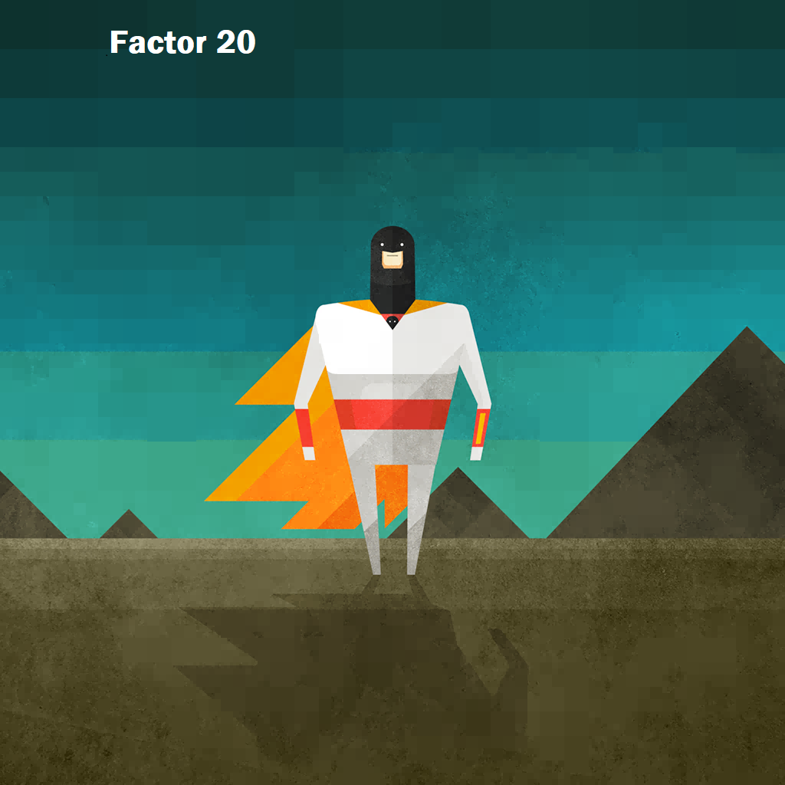
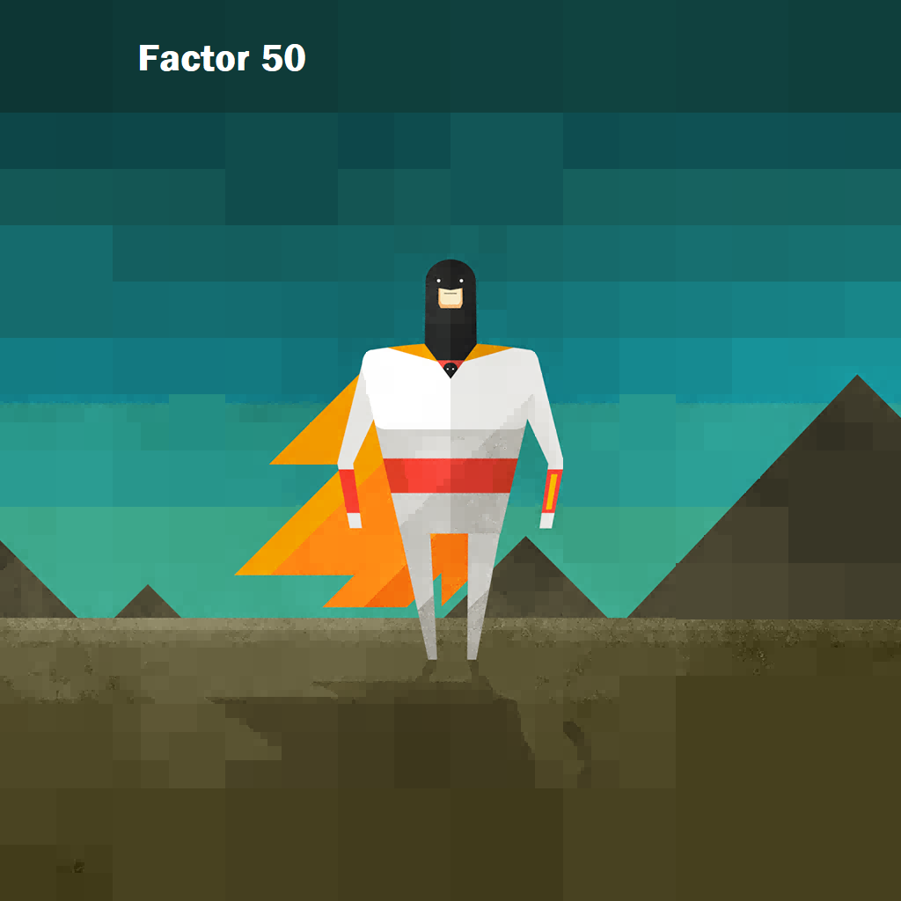
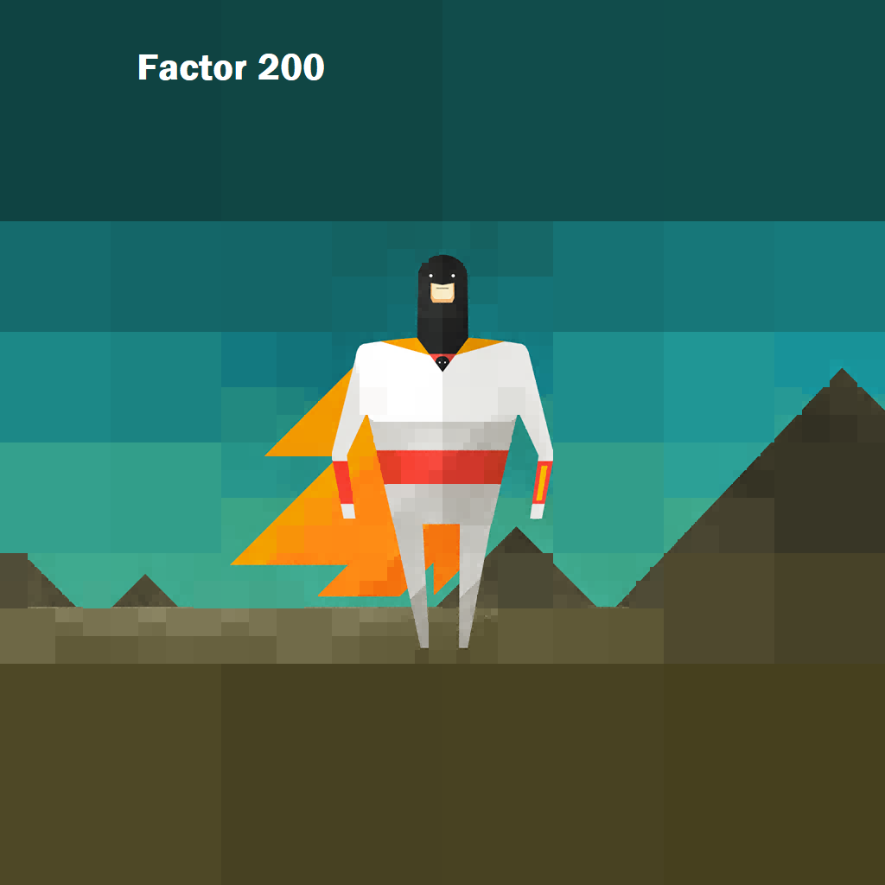

# PPM File compressor

This program in C uses quad trees to compress PPM image files. It works only for images with the same width and height. 

# How to use it?

## Compress
Open a Bash terminal and go to the code location. 
Use 'make' to create the executable. 
Locate your PPM file that meets the requirements (height == widht) and type "./cppm -c [Factor] [PPM_FILE_PATH] [OUT_FILE_PATH]" to compress an image.

Factor: The higher the value, the worse the quality. (Check photos for examples). Use 0 to compress the image with the default quality(Not recommended for big images or real-life photos).
PPM_FILE_PATH: The path to the PPM file you want to compress.
OUT_FILE_PATH: Where do you want to save the binary file with the compressed image.

Exemple: ./cppm -c 100 image.ppm image.out

## Decompress
Use "./cppm -d [COMPRESSED_FILE_PATH] [DECOMPRESSED_PPM_FILE]"

Example: ./cppm -d image.out image.ppm

# How does it work?
## Compression
We read the PPM file and save the pixels values into a matrix defined with TPixel type. TPixel holds 3 unsigned char values: red, green and blue, representing the color channels in RGB format.

We then enter an recursive function. Whe sum up the values in each chanel of all the pixels. We get the mean for each channel and calculate a score. If the score is lesser or equal than the factor, we save in the current node the mean values of red, green and blue for all the pixels. If not, we divide the block into 4 smaller blocks and we allocate memory for 4 new nodes. We recall this function for each block. At the end of the recursive function, a quadtree will be built. An inside node is a block that was divided, every leaf node holds some colors because those are the undivided blocks.

After that, we read the quad tree level by level. If we find an inside node, we write 0 into a binary file and if we find a leaf node, we write 1 followed by 3 values from 0 to 255 representing the value of each channel.

We also save the size of the PPM file before all of this.

## Decompression

We rebuild the quad tree based on the values in the file and create a square matrix of pixels based on the size we can find at the start of binary file.

We create a recursive function that divides the matrix into 4 smalled blocks while iterating through the quad tree. When we find a leaf node, we fill the block with the values inside the node.

All we have to do now is to write the header of a PPM file into the files passed as parameter when we run the program, and then iterate through the matrix and write the values of each pixel in the file.

# Examples

